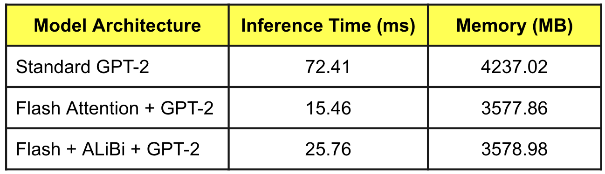
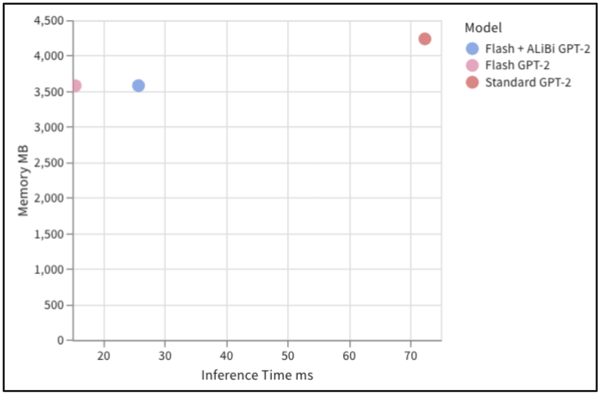
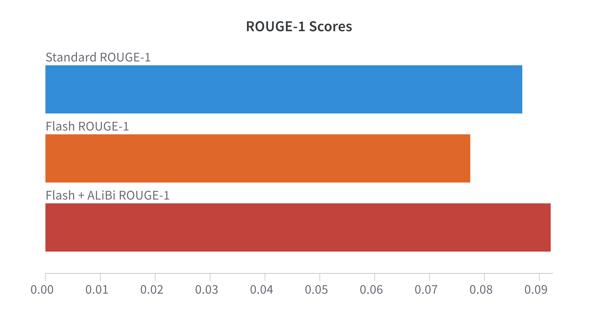
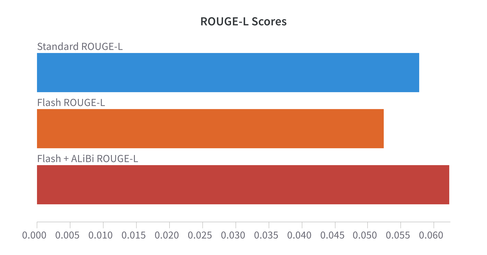
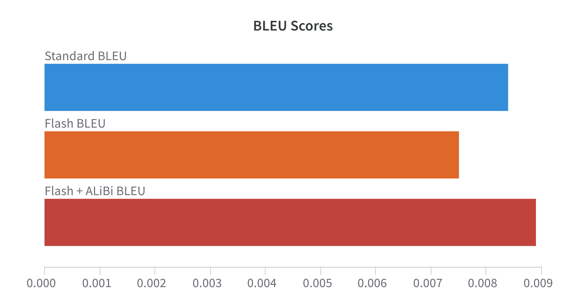

# Enhancing FlashAttention with ALiBi in Transformer Models

`Team: Sharmista Shastry (ss6950), Rishabh Srivastava (rs4489)`

This repository demonstrates the integration of ALiBi (Attention with Linear Biases) scores in FlashAttention to enhance performance. We used GPT-2 models to test this integration, comparing the resulting inference efficiency and text generation quality with standard attention and FlashAttention variants. The main goal was to explore how ALiBi can improve the performance of FlashAttention in language modeling tasks, particularly text summarization.

## Requirements

- Python
- PyTorch
- Hugging Face Transformers
- FlashAttention
- Datasets
- Wandb

First, install the flash attention (`flash_attn`) module by running the following commands:

```bash
git clone https://github.com/HazyResearch/flash-attention.git
cd flash-attention
git checkout v2.7.2.post1
git submodule update --init --recursive
pip install . --no-build-isolation
```

Install the necessary packages via pip:

```bash
pip install torch transformers datasets wandb nltk rouge-score tabulate
```

Since Flash Attention needs Ampere GPUs and above, so considerable GPU compute resources (A100 and above) are required.

## Dataset

We use the **CNN/DailyMail** dataset (version 3.0.0) for text summarization tasks. The dataset is split into training and validation subsets.

## Models

The model is configured with three variants:
1. Standard Attention in GPT-2
2. Flash Attention in GPT-2
3. Flash Attention with ALiBi in GPT-2

We also fine-tune the last GPT-2 model that has Flash Attention with ALiBi scores, since GPT-2's pre-trained weights are not adjusted to attention with ALiBi scores. 

## Running the Experiments
1. You can run the `main.py` script by this command:
```bash
python main.py
```
2. The code has also been presented in the Python Notebook `FlashAttn_with_ALiBi.ipynb` for an easier comprehension of the code flow.

## Results

The benchmarking results are displayed in two tables: **Efficiency Comparison** and **Quality Comparison**.

The efficiency comparison includes the inference time (in milliseconds) and memory usage (in MB) for each model.

<figure>
    <figcaption><b>Efficiency Metrics for Different Experiments</b></figcaption>
    
</figure>

<figure>
    <figcaption><b>Efficiency Metrics: Scatter Plot</b></figcaption>
    
</figure>

The quality comparison includes ROUGE-1, ROUGE-2, ROUGE-L, and BLEU scores for each model.

<figure>
    <figcaption><b>Quality Comparison: ROUGE-1</b></figcaption>
    
</figure>

<figure>
    <figcaption><b>Quality Comparison: ROUGE-2</b></figcaption>
    
</figure>

<figure>
    <figcaption><b>Quality Comparison: ROUGE-L</b></figcaption>
    
</figure>

<figure>
    <figcaption><b>Quality Comparison: BLEU</b></figcaption>
    
</figure>

You can find the **Wandb report** with performance benchamarking [here](https://wandb.ai/hpmlcolumbia/intro2llm/reports/Performance-and-Quality-Benchmarking-of-Standard-GPT-2-Flash-Attention-GPT-2-and-Flash-Attention-ALiBi-GPT-2--VmlldzoxMDYxMDkyMA?accessToken=a69c5flkf4r4r2bwepgfxfraj06efcyjs2z3actqn4uoj4hd0ye6my8lkltifc2r).

## Analysis of Results

### Efficiency Comparison

The following table compares the inference time and memory usage of three models: Standard GPT-2, Flash GPT-2, and Flash + ALiBi GPT-2.

|        Model        | Inference Time (ms) | Memory (MB) |
|---------------------|---------------------|-------------|
|   Standard GPT-2    |        72.41        |   4237.02   |
|     Flash GPT-2     |        15.46        |   3577.86   |
| Flash + ALiBi GPT-2 |        25.76        |   3578.98   |

- **Inference Time**: Flash GPT-2 shows a significant improvement in inference time, with a reduction from 72.41 ms (Standard GPT-2) to 15.46 ms. This demonstrates the efficiency gain provided by FlashAttention. However, the Flash + ALiBi GPT-2 model shows a slight increase in inference time (25.76 ms), which suggests that while ALiBi integration improves performance, it incurs a small overhead compared to the pure FlashAttention variant.
- **Memory Usage**: Flash GPT-2 reduces memory usage significantly from 4237.02 MB (Standard GPT-2) to 3577.86 MB. The Flash + ALiBi variant shows a marginal increase in memory usage (3578.98 MB), but it is still much lower than the memory required by the Standard GPT-2 model.

### Quality Comparison

The following table compares the text generation quality of the models using various evaluation metrics: ROUGE-1, ROUGE-2, ROUGE-L, and BLEU.

|        Model        | ROUGE-1 | ROUGE-2 | ROUGE-L |  BLEU  |
|---------------------|---------|---------|---------|--------|
|   Standard GPT-2    | 0.0870  | 0.0315  | 0.0578  | 0.0084 |
|     Flash GPT-2     | 0.0775  | 0.0282  | 0.0524  | 0.0075 |
| Flash + ALiBi GPT-2 | 0.0922  | 0.0336  | 0.0623  | 0.0089 |

- **ROUGE Scores**: The Flash + ALiBi GPT-2 model achieves the highest scores across all ROUGE metrics (ROUGE-1: 0.0922, ROUGE-2: 0.0336, ROUGE-L: 0.0623). This indicates that integrating ALiBi into FlashAttention improves the model's ability to capture semantic similarities in generated text. The Standard GPT-2 model performs better than Flash GPT-2 but lags behind Flash + ALiBi GPT-2.
- **BLEU Score**: Similarly, Flash + ALiBi GPT-2 achieves a slightly higher BLEU score (0.0089) compared to both the Standard GPT-2 (0.0084) and Flash GPT-2 (0.0075). This suggests that the Flash + ALiBi model generates slightly better quality text in terms of precision and n-gram overlap.

### Conclusion

- **Efficiency**: FlashAttention provides a significant boost in inference efficiency compared to the standard GPT-2 model, reducing both inference time and memory usage. The addition of ALiBi introduces a small overhead in inference time but still maintains a substantial reduction in memory usage compared to the original GPT-2 model.
- **Quality**: Integrating ALiBi into FlashAttention results in the best performance in terms of text generation quality across all evaluation metrics. Flash + ALiBi GPT-2 outperforms both Standard GPT-2 and Flash GPT-2, showing that the integration of ALiBi improves text generation without significantly sacrificing efficiency.

Overall, using the combination of Flash Attention and ALiBi Scores showed an improvement in the text summarization task, while also maintaining the advantages offered by the Flash Attention mechanism.

## References

1. Dao, T., Fu, D. Y., Ermon, S., Rudra, A., & Ré, C. (2022). FlashAttention: Fast and Memory-Efficient Exact Attention with IO-Awareness. *arXiv*. [https://arxiv.org/abs/2205.14135](https://arxiv.org/abs/2205.14135)

2. Press, O., Smith, N. A., & Lewis, M. (2022). Train Short, Test Long: Attention with Linear Biases Enables Input Length Extrapolation. *arXiv*. [https://arxiv.org/abs/2108.12409](https://arxiv.org/abs/2108.12409)

3. Hermann, K. M., et al. (2015). Teaching machines to read and comprehend. In *Proceedings of the 28th International Conference on Neural Information Processing Systems (NeurIPS 2015)*, 1693-1701. [https://arxiv.org/abs/1506.03340](https://arxiv.org/abs/1506.03340)


